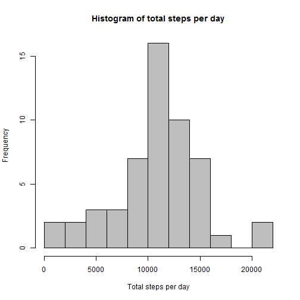
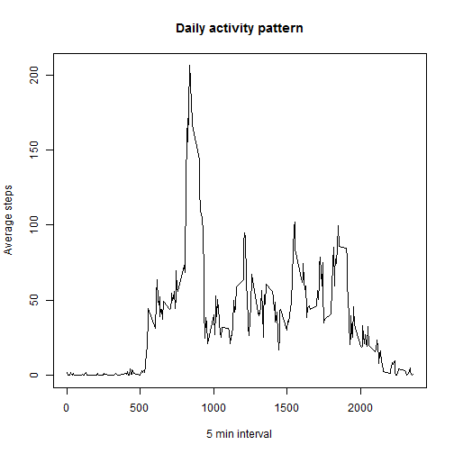
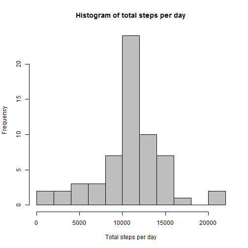
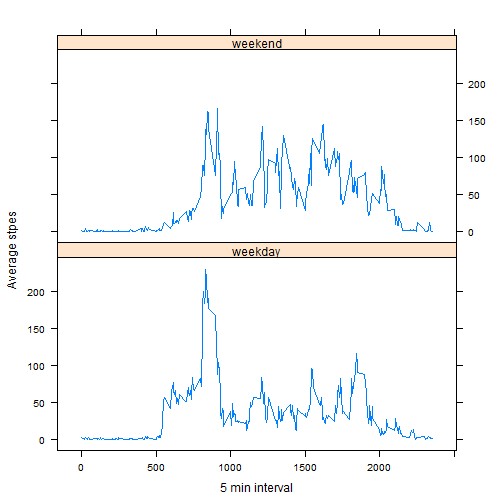

#Reproducible Research Project 1


##Loading the processing the data

###Load the necessary package

```r
library(dplyr)
library(lattice)
```

###Load the data and make it clean

```r
activity <- read.csv("repdata-data-activity/activity.csv", 
                     na.strings = "NA")
activity$date <- as.Date(activity$date)
head(activity)
```

```
##   steps       date interval
## 1    NA 2012-10-01        0
## 2    NA 2012-10-01        5
## 3    NA 2012-10-01       10
## 4    NA 2012-10-01       15
## 5    NA 2012-10-01       20
## 6    NA 2012-10-01       25
```

##What is mean total number of steps taken per day?

###Calculate the total number of steps taken per day

```r
totalno <- aggregate(steps ~ date, data = activity, na.rm = TRUE, sum)
head(totalno)
```

```
##         date steps
## 1 2012-10-02   126
## 2 2012-10-03 11352
## 3 2012-10-04 12116
## 4 2012-10-05 13294
## 5 2012-10-06 15420
## 6 2012-10-07 11015
```

###Make a histogram of the total number of steps taken each day

```r
hist(totalno$steps, col = "grey", breaks = 10, 
     xlab = "Total steps per day",
     main = "Histogram of total steps per day")
```



###Calculate the mean of the total number of steps taken per day

```r
mean(totalno$steps)
```

```
## [1] 10766.19
```

###Calculate the median of the total number of steps taken per day

```r
median(totalno$steps)
```

```
## [1] 10765
```

##What is the average daily activity pattern?

###Make a time series plot of the 5-minute interval (x-axis) and the average number of steps taken, averaged across all days (y-axis)
Calculate the average number of steps

```r
average <- activity%>%
  group_by(interval)%>%
  summarize(meansteps = mean(steps, na.rm = TRUE))
```

Make plot

```r
with(average,plot(average$interval, average$meansteps, 
                  type = "l", xlab = "5 min interval",
                  ylab = "Average steps",
                  main = "Daily activity pattern"))
```



###Find out which interval contains the maximum number of steps

```r
with(average, interval[which.max(meansteps)])
```

```
## [1] 835
```

##Inputing missing values
###Calculate and report the total number of missing values in the dataset
Calculate and report the number of missing values in steps

```r
sum(is.na(activity$steps))
```

```
## [1] 2304
```

Calculate and report the number of missing values in date

```r
sum(is.na(activity$date))
```

```
## [1] 0
```

Calculated and report the number of missing values in interval

```r
sum(is.na(activity$interval))
```

```
## [1] 0
```

Calculate and report the total number of missing values

```r
sum(is.na(activity$steps)) + sum(is.na(activity$date)) + sum(is.na(activity$interval))
```

```
## [1] 2304
```

###Fill in all of the missing values in the dataset
Use the mean for that 5-minute interval

```r
newact <- inner_join(activity, average, by = "interval")
newact$steps <- ifelse(is.na(newact$steps), 
                       newact$meansteps, newact$steps)
```

Create a new dataset that is equal to the original dataset but with the missing data filled in

```r
newact <- subset(newact, select = steps : interval)
head(newact)
```

```
##       steps       date interval
## 1 1.7169811 2012-10-01        0
## 2 0.3396226 2012-10-01        5
## 3 0.1320755 2012-10-01       10
## 4 0.1509434 2012-10-01       15
## 5 0.0754717 2012-10-01       20
## 6 2.0943396 2012-10-01       25
```

###Make a histogram of the total number of steps taken each day

```r
totalno2 <- aggregate(steps ~ date, data = newact, sum)
hist(totalno2$steps, col = "grey", breaks = 10,
     xlab = "Total steps per day", 
     main = "Histogram of total steps per day")
```



###Calculate and report the mean and median total number of steps taken per day
Calculate the mean

```r
mean(totalno2$steps)
```

```
## [1] 10766.19
```

Calculate the median

```r
median(totalno2$steps)
```

```
## [1] 10766.19
```

Mean and median are similar to the estimates from the first part of the assignment.  
Imputing missing values dose not affect the estimates of the total daily number of steps a lot.

##Are there differences in activity patterns between weekdays and weekends?

###Create a new factor variable in the dataset with two levels - "weekday" and "weekend" indicating whether a given date is a weekday or weekend day.

```r
newact$day <- weekdays(newact$date)
newact$day <- ifelse(newact$day %in% c("Saturday", "Sunday"),
                     "weekend", "weekday")
head(newact)
```

```
##       steps       date interval     day
## 1 1.7169811 2012-10-01        0 weekday
## 2 0.3396226 2012-10-01        5 weekday
## 3 0.1320755 2012-10-01       10 weekday
## 4 0.1509434 2012-10-01       15 weekday
## 5 0.0754717 2012-10-01       20 weekday
## 6 2.0943396 2012-10-01       25 weekday
```

###Make a panel plot

```r
newact_mean <- newact%>%
  group_by(interval, day)%>%
  summarize(meansteps = mean(steps))
xyplot(meansteps ~ interval | day, data = newact_mean,
       type = "l", layout = c(1,2),
       xlab = "5 min interval",
       ylab = "Average stpes")
```



Activity patterns of weekdays and activity patterns of weekends are different to each other.
